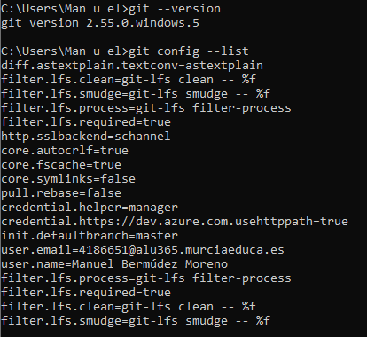
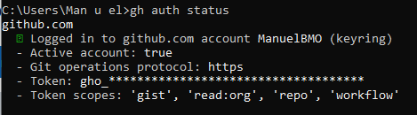
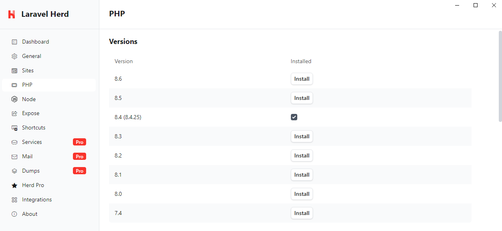
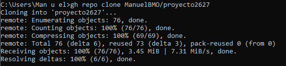
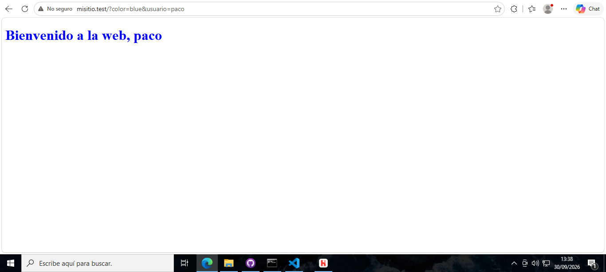

- Git instalado y configurado en local

- GitHub CLI instalado y configurado (gh auth status).

- Herd instalado con la versión de PHP 8.4.

- repositorio "misitio" clonado en local

- Herd enlazado al repositorio "misitio" y sirviéndolo en  HTTPS.
